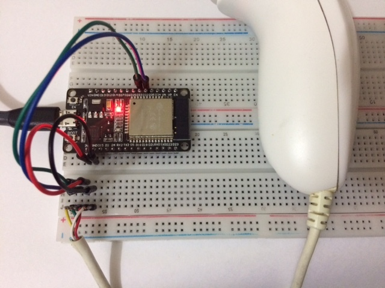

# esp32-wii-nunchuk

This is a library to use the Wii Nunchuk with the ESP32 via I2C.  It
uses the [ESP-IDF I2C
API](https://docs.espressif.com/projects/esp-idf/en/latest/esp32/api-reference/peripherals/i2c.html)
because the [Arduino Wire
library](https://www.arduino.cc/en/reference/wire) doesn't work
reliably in the ESP32 with Wii controllers.



This library supports the Wii Nunchuk and the Wii Classic Controller.
It should be easy to adapt it to work with other I2C devices that plug
in the Wiimote (like the Classic Controller Pro, Balance Board, etc.)
with the information available in the [Wiibrew
project](http://wiibrew.org/wiki/Wiimote/Extension_Controllers), but I
have none of these devices so I don't know for sure.

To use the library in your Arduino IDE sketch, just copy the files
`wii_i2c.c` and `wii_i2c.h` to your sketch directory.

### Example Code

Example code for using the library (to see a more complete example
with error checking, see the file `esp32-wii-nunchuk.ino`):

```C++
#include "wii_i2c.h"

// pins connected to the controller:
#define PIN_SDA  32
#define PIN_SCL  33

unsigned int controller_type = 0;

void setup()
{
  Serial.begin(115200);

  wii_i2c_init(PIN_SDA, PIN_SCL);
  const unsigned char *ident = wii_i2c_read_ident();
  controller_type = wii_i2c_decode_ident(ident);
  switch (controller_type) {
  case WII_I2C_IDENT_NUNCHUK: Serial.printf("-> nunchuk detected\n"); break;
  case WII_I2C_IDENT_CLASSIC: Serial.printf("-> classic controller detected\n"); break;
  default:                    Serial.printf("-> unknown controller detected: 0x%06x\n", controller_type); break;
  }
  wii_i2c_request_state();  // request first state
}

void loop()
{
  const unsigned char *data = wii_i2c_read_state();  // read current state
  wii_i2c_request_state();                           // request next state
  if (! data) {
    delay(1000);
    return;
  }

  switch (controller_type) {
  case WII_I2C_IDENT_NUNCHUK:
  {
     wii_i2c_nunchuk_state state;
     wii_i2c_decode_nunchuk(data, &state);
     Serial.printf("Z button is %s\n", (state.z) ? "pressed" : "not pressed");
  }
  break;
  
  case WII_I2C_IDENT_CLASSIC:
  {
     wii_i2c_classic_state state;
     wii_i2c_decode_classic(data, &state);
     Serial.printf("B button is %s\n", (state.b) ? "pressed" : "not pressed");
  }
  break;
  
  default:
    Serial.printf("unknown controller data: %02x %02x %02x %02x %02x %02x\n",
                  data[0], data[1], data[2], data[3], data[4], data[5]);
    break;
  }

  delay(1000);
}
```

